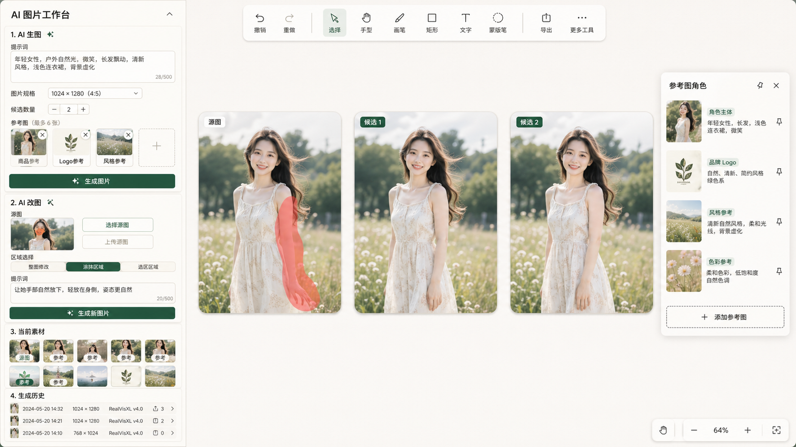

# AI 图片工作台改造方案

日期：2026-04-28  
执行者：Codex

## 当前状态

日期：2026-05-01
执行者：Codex

本文档中的工作台结构已落地到桌面端和移动端。当前实现包含 AI 生图、AI 改图、当前素材、生成历史四个工作区，并补齐移动端标题栏、同步/保存入口、参考图角色标记、素材预览删除、涂抹区域笔触控制、生成反馈和画布结果间隔排布。

## 界面稿

该界面稿作为当前阶段的视觉目标：左侧从“画板工具堆叠”调整为“AI 图片工作台”，画布保留 tldraw 的自由编排能力，AI 生图、AI 改图、当前素材和生成历史统一收束在一个清晰工作流中。

## 目标

- 将画板主体验调整为 AI 生图与 AI 改图工作台。
- AI 生图支持提示词结合 0 到多张参考图生成图片。
- AI 改图支持上传或选择源图，通过提示词进行整图修改，或通过涂抹/选区进行局部修改。
- 结果默认放在源图旁边用于对比，不覆盖原图。
- 当前阶段素材与历史限定在当前画板内，继续使用本地存储。

## 工作台结构

### AI 生图

- 输入源图提示词。
- 选择源图规格。
- 上传 0 到多张生图参考图。
- 每张参考图可选角色：主体人物、五官脸型、发型发色、妆容参考、身形比例、整体服装、上衣参考、下装参考、连衣裙参考、鞋子参考、包包参考、帽子参考、配饰参考、商品参考、Logo 参考、场景参考、背景参考、动作姿势、构图机位、风格参考。
- 点击生成后，请求以 `text_to_image` 模式提交；存在参考图时一并提交参考图与角色信息。

### AI 改图

- 源图可以来自上传、画布选中图片或当前素材。
- 编辑区域不是强制项；不涂抹、不选区时走整图关键词修改。
- 需要局部修改时，可以用画布蒙版笔涂抹，也可以先使用现有选区生成/选区参考能力。
- 新图规格独立选择，避免改图结果被压低分辨率。
- 结果插入源图旁边，形成对比，而不是覆盖原图。

### 当前素材

- 仅显示当前画板资产。
- 素材可一键设为源图或追加为参考图。
- 源图和参考图都支持清除后重新选择。

### 生成历史

- 展示当前画板最近生成任务。
- 画布中同步保留生成历史 shape，记录 prompt、模型、尺寸与结果关联。

## 数据与接口

- `AppSnapshot.referenceItems` 持久化参考图列表和角色。
- 兼容旧字段 `referenceAssetIds` 与 `referenceAssetIdsByRole`，导入旧快照时自动转换。
- `/api/generation-jobs` 接收 `referenceItems`，通过共享参考角色表校验角色，并将标准化后的 `referenceAssetIds` 与 `referenceItems` 写入任务参数。
- 文生图无参考图时使用 `images.generate`；存在参考图时使用多图 `images.edit`。
- 改图模式允许不带 mask；只有真实涂抹区域时才上传 mask。

## 实施边界

- 优先完成 UI 工作台结构、参考图角色标记、生成/改图主链路整理。
- 任意 tldraw 选区转精确 mask 作为后续增强；当前先保留选区导出为参考图与选区生成能力。
- 不引入线上存储、协作或跨画板素材库。

## 实施步骤

1. 固化界面稿和方案文档。
2. 重构画板侧栏为 `AI 生图`、`AI 改图`、`当前素材`、`生成历史`。
3. 将参考图状态升级为多图加角色模型，并兼容旧快照。
4. 调整前端生成请求，使文生图和局部改图都能携带参考图。
5. 调整后端生成接口，保存参考图角色参数并支持多参考图输入。
6. 执行 lint、build 和浏览器冒烟验证。

## 验收点

- 侧栏按 `AI 生图`、`AI 改图`、`当前素材`、`生成历史` 分区。
- 参考图可多张上传、从素材选择、逐张移除、清空，并可选角色。
- 文生图请求可以携带多张参考图与角色信息。
- 改图请求保留源图、蒙版、参考图与提示词链路。
- 页面通过 lint、build 和浏览器冒烟验证。

## 已知后续增强

- 将任意 tldraw 选区精确转换为局部编辑 mask。
- 生成历史列表支持一键复用 prompt、参考图和尺寸。
- 参考图角色已细化到角色外观、服饰单品、场景、动作和构图；后续可继续增加“需要严格复刻材质”“只参考风格”等强度约束。
